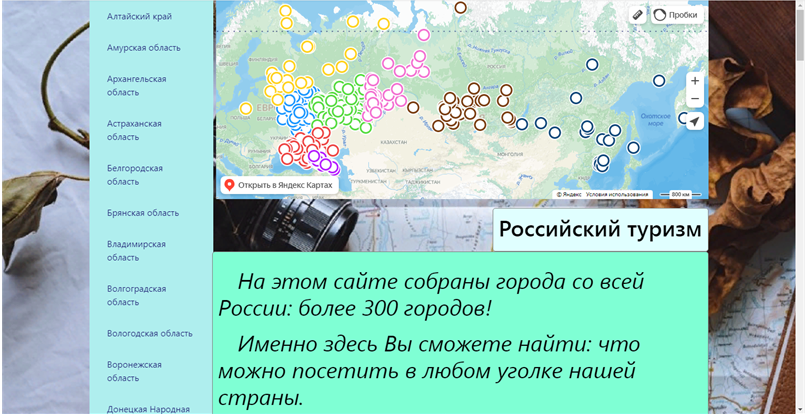
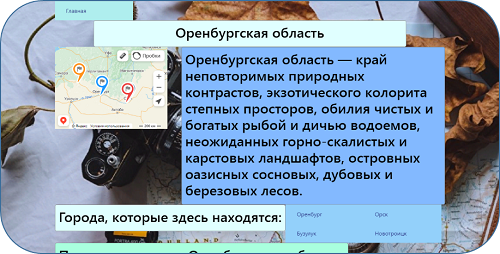
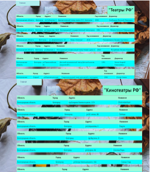
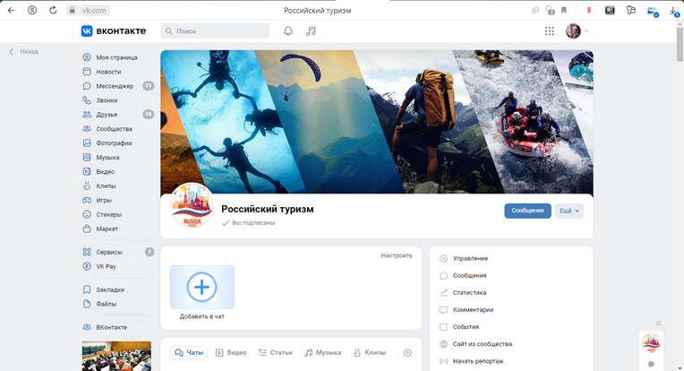
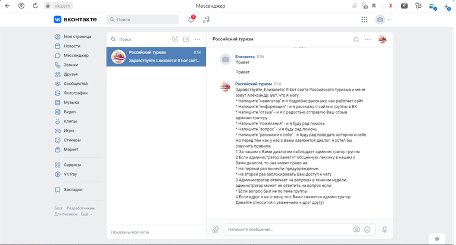
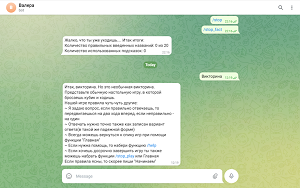

<h1 align='center'>Российский туризм</h1>
<h1 align='center'>https://continuous-far-honeysuckle.glitch.me/</h1>
<h3><b>Российский туризм</b> - динамично развивающаяся отрасль в России</h3>
<h2>Проект выполняет следующие задачи:</h2>
<h3><b>1)</b>  Увидеть уникальность каждого региона</h3>
<h3><b>2)</b>  Увидеть на сколько богатая Россия в сфере туризма</h3>

<h2>Если говорить о проекте в цифрах, то:</h2>
<h3>На сайте собраны все 89 субъектов РФ, 369 городов, 649 театров, 1020 кинотеатров</h3>
<h3>Города собраны по принципу: численность населения начинается от 50000 человек</h3>

<h2>Как мне пришла идея для проекта?</h2>
<h3>Начиная с 5 лет, я с родителями каждый год путешествую. За свою жизнь  я уже посетила около 6 стран и более 30 городов России. Но перед поездкой важно найти места, которые стоит посетить; причины, стоит ли вообще ехать в этот регион, город. И на все это уходит очень много времени, так как это приходится искать на разных сайтах. На моем сайте вся информация собрана, что позволяет не тратить много времени</h3>

<h2>Из чего состоит проект?</h2>
<h3>Проект состоит из <b>Веб-сайта</b>, <b>ВК бота</b>, <b>ВК сообщества</b> и <b>Телеграмм бота</b></h3>

<h2>Веб-сайт</h2>
<h3>На главной странице можно увидеть регионы(кнопки, переходя по которым можно увидеть информацию), карта России с нанесенными городами, также кнопки Театры и Кинотеатры РФ и кнопка, чтобы перейти в ВК сообщество</h3>

<h3>1.  Регионы</h3>
<h3>Здесь можно увидеть:</h3>
<h4>1. Название региона</h4>
<h4>2. Уникальность или мотивирующую фразу поехать в этот регион</h4>
<h4>3. Города, которые здесь находятся</h4>
<h4>4. Причины посетить регион</h4>
<h4>5. Фотографии региона,городов</h4>

<h3>2. Театры РФ</h3>
<h4>Здесь можно увидеть какие театры есть в регионах, их адрес, название, год основания, директора</h4>

<h3>3. Кинотеатры РФ</h3>
<h4>Здесь можно увидеть какие кинотеатры есть в регионах, их адрес и название</h4>

<h2>ВК сообщество</h2>
<h2>https://vk.com/public219609269</h2>
<h3>Это группа, в которой я публикую новости сайта, фотографии регионов, рассказываю, если есть обновления</h3>

<h2>ВК бот</h2>
<h3>Бот по имени Александр обитает в сообщениях ВК сообщества. Он является моим главным помощником</h3>
<h3>Функции, которые он выполняет:</h3>
<h4>1. Отвечает пользователям. Я чисто физически не смогу ответить сразу всем людям. А пока я буду отвечать одному, другой может покинуть сайт, группу</h4>
<h4>2. Функция "навигатор" - когда пользователь пишет это слово, бот помогает людям ориентироваться на сайте, вк группе</h4>
<h4>3. Функция "информация" - бот рассказывает о том, кто создал сайт, проект в цифрах и цели проекта</h4>
<h4>4. Функции "отзыв", "пожелания" и "вопросы" - бот принимает от пользователя обратную связь и отправляет мне. Если это вопрос, то внутри того же диалога связываюсь с человеком и даю ответ</h4>
<h4>5. Функции "расскажи о себе" или "расскажи про автора" - бот рассказывает про себя, свои функции или рассказывает про меня пару слов</h4>
<h4>6. Также может ответить человеку, если тот поблагодарил бота или попрощался с ним</h4>

<h2>Телеграмм бот</h2>
<h2>https://t.me/RT_russian_travel_bot</h2>
<h3>Телеграмм бот по имени Валера. Он является - учителем и приятелем, с которым можно провести время</h3>
<h3>Функции, которые он выполняет:</h3>
<h4>1. Функция "Викторина" - на подобии настольной игры, отвечая на вопросы правильно можно получить пропуск хода. Играя в игру, пользователь выполняет два действия сразу: проводит время и обновляет знания о России.</h4>
<h4>2. Функция "Интересные факты" - по приведенным фактам и фотографии нужно догадаться о каком городе идет речь</h4>
<h4>3. Функция "Списки языков" - здесь можно познакомиться с некоторыми языками народов России. А также попросить бота перевести слово на этот язык</h4>
<h4>4. Бот по имени человека определяет пол и ведет диалог в соответствующей форме</h4>

<h2>Что будет дальше?</h2>
<h3>Я продолжу работу сайта, ботов и вк группы. Также планируется обновление навыков ботов.</h3>

<h2>При помощи каких технологий поддерживается работа проекта?</h2>
<h3>Сайт поддерживается при помощи: https://glitch.com/</h3>
<h3>Работа ботов поддерживается сайтом: https://pythonanywhere.com</h3>
